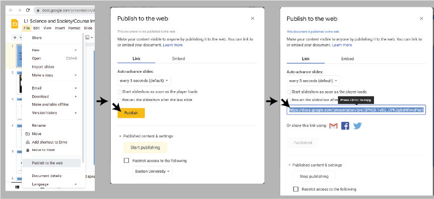

# jekyll course website template

This repo contains a template for creation of course websites. The website structure is driven dynamically from a CSV
file `_data/schedule.csv`. This allows the content descriptions, pages, and schedule to be easily updated with new
dates, lecture order, etc. The template is designed to build with Github Pages when pushed to Github.

Be sure to configure your GitHub repo to use GitHub Pages and point it to the main branch.

## Getting started

1. Download
   the [Source code for the latest release](https://github.com/adamlabadorf/jekyll_course_website_template/releases/tag/1.0)
   of this repo from GitHub
2. Expand the archive on your computer, and rename it to something like what your website will be called,
   e.g. `bf500_course_website`
3. Initialize the repo as a git repo using your favorite git client, e.g. `git init .` from inside the new directory
4. Create a new repo on GitHub for your course site, and follow the instructions to push your local repo to GitHub
5. [Enable Pages on your GitHub repo](https://docs.github.com/en/pages/quickstart) from the Settings page
6. Customize the content of your site following the instructions below

## Initial Configuration

Things to do:

1. **Create/edit `_data/schedule.csv`** using the scheme described below
2. **Create markdown files for your topic and assignment tags** Create files in the `_lectures/` and `_assignments/`
   directories for each of the tags in your schedule CSV
3. **Edit `_config.yml`** Set the `url` and `title` fields appropriately
4. **Edit `assets/css/style.scss`** You can configure all the colors of the site using the variables in this file.
5. **Remove the `relative_include` tag from `index.md`** so this readme doesn't appear on the main page

## `_data/schedule.csv`

The file `_data/schedule.csv` specifies the details of all course content and is used to populate the site dynamically.
This should be a comma separated value file with the following columns:

1. `Date` Any format (e.g. 1/27/2023)
2. `Day` Day of week (e.g. M, T, W, etc)
3. `Lec` Lecture number as integers (e.g. 1,2,3,...)
4. `Topic` Human-readable name of lecture
5. `Topic Tag` Machine-readable tag for lecture
6. `Topic Slide Link` Publish URL for google slides
7. `Assignment` Human-readable name of assignment
8. `Assignment Tag` Machine-readable tag for lecture
9. *Additional custom columns*

The first row of `schedule.csv` should have the exact column names as above in that order. Each row of the spreadsheet
causes a row in the Schedule table to be created as follows:

1. `Date`, `Day`, and `Lec` columns are added as-is
2. The `Topic` column is populated dynamically based on the data in the row:
   1. If `Lec` has no value, the row is colored white. This is useful for semester dates when class is not held, e.g.
      spring break.
   2. If `Lec` has a value, the row is colored normally, and the field contains:
      1. If `Topic Tag` has a value, a link to the page `_lectures/<Topic Tag>.html` with the text in `Topic`
      2. If `Topic Tag` does not have a value, the `Topic` text is placed in the column with no link
3. The `Assignment` column follows the same logic as the `Topic` column, except with `Assignment` and `Assignment Tag`
   values, and links are to `_assignments/<Assignment Tag>.html`n
4. Any additional columns in the spreadsheet will be ignored but may be added manually by customizing `schedule.md`

The `Tag` column values should have no spaces in them and no special characters other than hyphens `-`.

## Lecture/Assignment pages

The template expects there to be an individual markdown document under `_lectures` or `_assignments` for
each `Topic Tag` or `Assignment Tag`, respectively. For example, if a `Topic Tag` is `intro-lecture-1`, the template
looks for the file `_lectures/intro-lecture-1.md`. Similarly for `Assignment Tag`. The contents of the file must include
the standard markdown header at minimum:

```
---
---

This is additional text for the page that you can write
```

There are two special features on lecture pages:

1. Automatically generates links at the top of individual lecture pages to go forward/backward along the
lectures according to the `Lec` value in the spreadsheet. 
2. If `Topic Slide Link` has a value, the slides are embedded at the top of the page

## Slide Links

The site is designed specifically to show Google Slides decks that have been published. The link in `schedule.csv` must
be the link obtained as follows:



<a rel="license" href="http://creativecommons.org/licenses/by-nc-nd/3.0/us/"></a><br />
This work is licensed under a <a rel="license" href="http://creativecommons.org/licenses/by-nc-nd/3.0/us/">Creative
Commons Attribution-NonCommercial-NoDerivs 3.0 United States License</a>.
